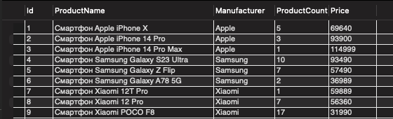
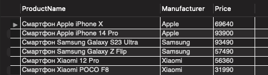
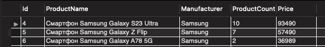
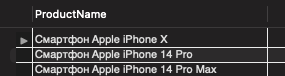
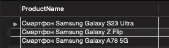
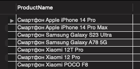
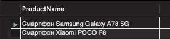

## Домашнее задание. Семинар 1

### 1. 	Создайте таблицу с мобильными телефонами, используя графический интерфейс. 

#### Id, ProductName, Manufacturer, ProductCount, Price 

```
CREATE SCHEMA 'hw_1' ;

CREATE TABLE 'hw_1'.'mobile' (
  'Id' INT NOT NULL AUTO_INCREMENT,
  'ProductName' VARCHAR(45) NOT NULL,
  'Manufacturer' VARCHAR(45) NOT NULL,
  'ProductCount' INT NULL,
  'Price' INT NULL,
   PRIMARY KEY ('Id'));
```

#### Заполните БД данными.
```
INSERT INTO 'hw_1'.'mobile' ('Id', 'ProductName', 'Manufacturer', 'ProductCount', 'Price') VALUES ('1', 'Смартфон Apple iPhone X', 'Apple', '5', '69640');
INSERT INTO 'hw_1'.'mobile' ('Id', 'ProductName', 'Manufacturer', 'ProductCount', 'Price') VALUES ('2', 'Смартфон Apple iPhone 14 Pro', 'Apple', '3', '93900');
INSERT INTO 'hw_1'.'mobile' ('Id', 'ProductName', 'Manufacturer', 'ProductCount', 'Price') VALUES ('3', 'Смартфон Apple iPhone 14 Pro Max', 'Apple', '1', '114999');
INSERT INTO 'hw_1'.'mobile' ('Id', 'ProductName', 'Manufacturer', 'ProductCount', 'Price') VALUES ('4', 'Смартфон Samsung Galaxy S23 Ultra', 'Samsung', '10', '93490');
INSERT INTO 'hw_1'.'mobile' ('Id', 'ProductName', 'Manufacturer', 'ProductCount', 'Price') VALUES ('5', 'Смартфон Samsung Galaxy Z Flip', 'Samsung', '7', '57490');
INSERT INTO 'hw_1'.'mobile' ('Id', 'ProductName', 'Manufacturer', 'ProductCount', 'Price') VALUES ('6', 'Смартфон Samsung Galaxy A78 5G', 'Samsung', '2', '36989');
INSERT INTO 'hw_1'.'mobile' ('Id', 'ProductName', 'Manufacturer', 'ProductCount', 'Price') VALUES ('7', 'Смартфон Xiaomi 12T Pro', 'Xiaomi', '1', '59889');
INSERT INTO 'hw_1'.'mobile' ('Id', 'ProductName', 'Manufacturer', 'ProductCount', 'Price') VALUES ('8', 'Смартфон Xiaomi 12 Pro', 'Xiaomi', '7', '56360');
INSERT INTO 'hw_1'.'mobile' ('Id', 'ProductName', 'Manufacturer', 'ProductCount', 'Price') VALUES ('9', 'Смартфон Xiaomi POCO F8', 'Xiaomi', '17', '31990');
```


### 2. Выведите название, производителя и цену для товаров, количество которых превышает 2
```
SELECT ProductName, Manufacturer, Price FROM hw_1.mobile
WHERE ProductCount > 2;
```


### 3. Выведите весь ассортимент товаров марки “Samsung”
```
SELECT * FROM hw_1.mobile
WHERE Manufacturer = 'Samsung';
```


### 4. С помощью регулярных выражений найти:

* Товары, в наименовании которых есть упоминание "Iphone"
```
SELECT ProductName FROM hw_1.mobile
WHERE ProductName LIKE '%iPhone%';
```


* Товары, в наименовании которых есть упоминание "Samsung"
```
SELECT ProductName FROM hw_1.mobile
WHERE ProductName LIKE '%Samsung%';
```


* Товары, в наименовании которых есть ЦИФРЫ
```
SELECT ProductName FROM hw_1.mobile
WHERE ProductName REGEXP '[0-9]+';
```


* Товары, в наименовании которых есть ЦИФРА "8"
```
SELECT ProductName FROM hw_1.mobile
WHERE ProductName LIKE '%8%';
```
